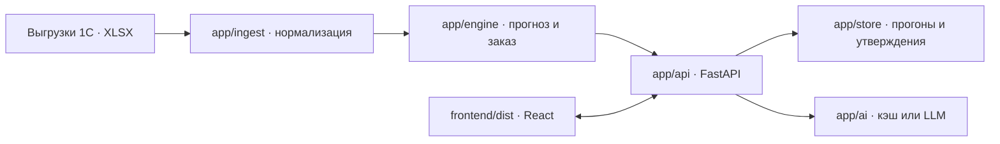

<div align="center">

# GrimStack

Планирование заказов поставщикам по выгрузкам 1С: прогноз спроса, рекомендации по SKU и контроль решений менеджера.


</div>

## Запуск за минуту

Нужен Python 3.12 или новее; Node.js и API-ключ не нужны. Из корня проекта:

```bash
python3 -m venv .venv
.venv/bin/python -m pip install -r requirements.txt
.venv/bin/python -m app
```

Через 10–15 секунд, после строки `Application startup complete`, откройте `http://localhost:8000`. Windows, Docker и запуск на другом порту описаны в разделе [«Быстрый старт»](#быстрый-старт), сценарий для проверки — в разделе [«Проверка работы»](#проверка-работы).

## Содержание

- [Запуск за минуту](#запуск-за-минуту)
- [Назначение](#назначение)
- [Возможности](#возможности)
- [Сценарий работы](#сценарий-работы)
- [Архитектура](#архитектура)
- [Технологии](#технологии)
- [Данные и интеграции](#данные-и-интеграции)
- [Быстрый старт](#быстрый-старт)
- [Проверка работы](#проверка-работы)
- [Основные команды](#основные-команды)
- [API и ошибки](#api-и-ошибки)
- [Качество прогноза](#качество-прогноза)
- [Известные ограничения](#известные-ограничения)
- [Внешние материалы и AI-инструменты](#внешние-материалы-и-ai-инструменты)
- [Развёртывание](#развёртывание)

## Назначение

GrimStack помогает менеджеру закупок подготовить заказы IEK и Systeme Electric по выгрузкам 1С. Сервис рассчитывает количество для каждого SKU с учётом спроса, остатка, товара в пути и кратности поставки. Менеджер проверяет рекомендацию, при необходимости меняет количество и утверждает заказ.

## Возможности

Приложение покрывает путь от загрузки выгрузок до утверждения и экспорта заказа.

| Возможность | Что получает менеджер |
| :-- | :-- |
| Данные | Встроенные XLSX-выгрузки IEK и SE при запуске или загрузка собственного набора через интерфейс |
| Расчёт | Прогноз с обработкой разовых продаж, месяцев без товара, сезонности и тренда; сравнение с Excel-методом |
| Работа с заказом | История SKU, объяснение рекомендации, правка количества с проверкой кратности, утверждение и экспорт XLSX |
| Сводка | Запрос к OpenAI-совместимому API или подготовленный образец из `samples/cache/` |
| Проверка метода | Бэктест прогноза на шести контрольных точках в `data/backtest/report.json` |
| Сценарий «что если» | «Аналитика» → блок «Задержка поставщика»: второй расчёт с увеличенным сроком поставки и изменения количества, срочности и суммы (`POST /api/runs/compare`) |

## Сценарий работы

От входных выгрузок до результата менеджер проходит четыре шага:

1. Выбирает встроенные данные поставщика или загружает собственные XLSX-файлы.
2. Запускает расчёт и сравнивает рекомендацию с базовым Excel-методом.
3. Проверяет историю и объяснение по SKU, при необходимости меняет итоговое количество с учётом кратности.
4. Утверждает заказ и скачивает XLSX для 1С. Сервис не отправляет заказ поставщику автоматически.

## Архитектура

Один процесс FastAPI обслуживает API и собранный React-интерфейс. Данные проходят через нормализацию, расчёт и проверку заказа:



`app/ingest/` приводит выгрузки 1С к единому `Dataset`. `app/engine/` очищает спрос, восстанавливает спрос в месяцы без товара, прогнозирует и рассчитывает заказ. `app/api/` вызывает ядро, проверяет изменения менеджера и отдаёт JSON/XLSX. `app/store.py` держит наборы и прогоны в памяти. `frontend/` показывает параметры, строки заказа и историю SKU.

`analyze` учитывает очистку, stockout, сезонность и тренд. `baseline` использует среднее сырых продаж за последние 12 закрытых месяцев без этих поправок при той же политике остатка, товара в пути и кратности.

Формы данных заданы в `app/contracts.py` и повторены в `frontend/src/api/types.ts`. Подробности алгоритма находятся в `docs/design.md`, структура проекта — в `docs/structure.md`.

## Технологии

Стек подтверждён `requirements.txt`, `frontend/package-lock.json` и `Dockerfile`.

| Область | Технологии | Назначение |
| :-- | :-- | :-- |
| Сервер и API | Python 3.12+, FastAPI, Pydantic, Uvicorn | HTTP-контракт, валидация и выдача интерфейса |
| Расчёт и файлы | pandas, NumPy, openpyxl | Обработка выгрузок, прогноз и экспорт XLSX |
| Интерфейс | React, TypeScript, Vite, TanStack Query, ApexCharts | Работа с расчётом, заказами и графиками |
| Запуск | Docker или локальный Python | Один серверный процесс с готовым `frontend/dist` |
| AI | Laya (офлайн), OpenAI-совместимый API (`gpt-4o-mini` по умолчанию; NVIDIA NIM через `OPENAI_BASE_URL`) | Товарные группы по наименованиям; текстовая сводка по готовым цифрам заказа |

## Данные и интеграции

В репозитории есть выгрузки 1С IEK и Systeme Electric в `data/raw/iek/` и `data/raw/se/`. Через интерфейс можно загрузить собственный набор XLSX-файлов. Профиль данных описан в `docs/data-profile.md`.

Товарные группы читаются из `data/categories/sku_categories.csv`. Для подготовки этого справочника отдельно применялась модель Laya; при запуске сервиса она не нужна. Сводка заказа использует OpenAI-совместимый API с необязательными `OPENAI_API_KEY`, `OPENAI_BASE_URL` и `MODEL`. Без ключа основные расчёты, правка и экспорт работают; для исходных расчётов доступны образцы из `samples/cache/`. Если подходящего образца нет, сводка возвращает `503`.

## Быстрый старт

Для запуска готового приложения достаточно Docker или Python 3.12 и новее (проверено на 3.12 и 3.14). Node.js не нужен: собранный интерфейс `frontend/dist` уже находится в репозитории. Все команды выполняются из корня проекта; остановка сервера — `Ctrl+C`.

### Docker: macOS, Linux и Windows

Установите и запустите Docker Desktop (macOS/Windows) или Docker Engine (Linux). В macOS используйте терминал zsh/bash, в Linux и Windows WSL — bash, в Windows без WSL — CMD. Команды одинаковы во всех этих терминалах:

```bash
docker build -t grimstack .
docker run --rm -p 8000:8000 -v grimstack-var:/srv/var grimstack
```

Docker выбирает поддерживаемый вариант базового образа для своей платформы. Именованный том `grimstack-var` сохраняет базу утверждений SQLite `var/app.db` между запусками контейнера. При повторном запуске достаточно второй команды.

### Python: macOS, Linux и Windows WSL

Установите Python 3.12 или новее с модулями `venv` и `pip`; версию покажет `python3 --version`. В macOS в терминале zsh/bash, а в Linux и Windows WSL в bash выполните из корня проекта:

```bash
python3 -m venv .venv
.venv/bin/python -m pip install -r requirements.txt
.venv/bin/python -m app
```

Окружение `.venv` создаётся для текущей ОС. Если проект используется и из Windows, и из WSL, держите отдельную копию проекта с собственным `.venv` для каждой среды.

### Python: Windows CMD

Установите Python 3.12 или новее с Python Launcher (`py`) и `pip`. В CMD из корня проекта выполните:

```bat
py -3 -m venv .venv
.venv\Scripts\python.exe -m pip install -r requirements.txt
.venv\Scripts\python.exe -m app
```

После сообщения Uvicorn о старте откройте `http://localhost:8000`. Адрес `http://localhost:8000/health` должен вернуть `{"status":"ok"}`. Первая загрузка встроенных XLSX может занять время; дождитесь сообщения о старте перед проверкой.

Если порт 8000 занят (в логе `address already in use`), запустите сервис на другом порту и откройте `http://localhost:8001`:

```bash
PORT=8001 .venv/bin/python -m app
```

В Windows CMD сначала выполните `set PORT=8001`, затем `.venv\Scripts\python.exe -m app`.

Необязательные настройки задаются переменными окружения или файлом `.env` в корне проекта. Для локального Python можно скопировать `.env.example` и заполнить нужные значения. Для Docker в macOS zsh/bash, Linux/WSL bash или Windows CMD добавьте `--env-file .env` перед именем образа:

```bash
docker run --rm -p 8000:8000 -v grimstack-var:/srv/var --env-file .env grimstack
```

| Переменная | Назначение |
| :-- | :-- |
| `OPENAI_API_KEY` | Ключ LLM для новых сводок |
| `OPENAI_BASE_URL` | Адрес OpenAI-совместимого провайдера, в том числе NVIDIA NIM |
| `MODEL` | Идентификатор модели у выбранного провайдера |
| `PORT` | Порт сервиса; по умолчанию `8000` |

Если меняете `PORT` при запуске Docker, укажите тот же порт с обеих сторон аргумента `-p`.

## Проверка работы

Дождитесь запуска Uvicorn и откройте `http://localhost:8000/health`: ответ `{"status":"ok"}` подтверждает, что встроенные данные загружены. Основной сценарий проверяется без API-ключа:

1. Запустите приложение по инструкции для своей ОС в разделе «Быстрый старт» и откройте `http://localhost:8000`.
2. Откройте раздел **«Данные и расчёт»**, выберите **Systeme Electric** из встроенных данных `data/raw/se/`, оставьте метод «Наш расчёт» и параметры по умолчанию, нажмите **«Рассчитать»**. Затем перейдите в **«Заказы»**.
3. В поиске введите `030200193_` и откройте строку **IMT35150**. Видно **37 800 шт. в пути**, рекомендацию **22 680 шт.** и сравнение с Excel-методом **0 шт.**
4. Нажмите **«Сводка»** у поставщика: появится сохранённый текст с пометкой «Из кэша». Нажмите **«Excel для 1С»**: скачается `order_SE_<дата>.xlsx`.
5. Для проверки управляемости измените итоговое количество IMT35150 на `26 460` (семь упаковок по `3 780`) и сохраните: в строке появится `26 460`. Затем утвердите заказ. После утверждения правка блокируется; автоматической отправки поставщику нет.

## Основные команды

После первой установки запускайте сервис и тесты из корня проекта командами для своей среды.

| Задача | macOS zsh/bash, Linux и WSL bash | Windows CMD |
| :-- | :-- | :-- |
| Повторный запуск | `.venv/bin/python -m app` | `.venv\Scripts\python.exe -m app` |
| Тесты | `.venv/bin/python -m pytest -q` | `.venv\Scripts\python.exe -m pytest -q` |

Для повторной сборки интерфейса нужны Node.js 24 или новее и npm. В macOS zsh/bash, Linux/WSL bash или Windows CMD выполните из корня проекта:

```bash
npm ci --prefix frontend
npm run build --prefix frontend
```

Сборка обновляет `frontend/dist`; обычный запуск готового приложения Node.js не требует.

## API и ошибки

Маршруты API имеют префикс `/api`. Ошибки возвращаются в едином JSON-формате `{"detail": "...", "code": "...", "meta": {}}`.

| HTTP | `code` | Ситуация |
| :-- | :-- | :-- |
| 404 | `not_found` | Нет прогона, SKU, поставщика, набора данных или маршрута API; неверный метод у маршрута `/api/*` |
| 404 | `backtest_not_found` | Файл отчёта бэктеста отсутствует |
| 405 и другие HTTP-ошибки | `http_error` | Неподдерживаемый запрос вне `/api`, например неверный метод у `/health` |
| 409 | `conflict` | Заказ уже утверждён |
| 422 | `validation_error` | Запрос не прошёл проверку схемы |
| 422 | `invalid_input` | Некорректное количество или форма загрузки, файл больше 30 МБ |
| 422 | `unknown_role`, `missing_file`, `empty_file`, `not_xlsx`, `bad_format` | Ошибка XLSX; роль файла в `meta.file_role`, когда известна |
| 503 | `unavailable` | Сводка недоступна через провайдера и в кэше нет подходящего ответа |
| 500 | `internal_error` | Неожиданная ошибка; детали пишутся в серверный лог |

## Качество прогноза

Отчёт бэктеста хранится в `data/backtest/report.json` и доступен по `GET /api/backtest`; методика описана в `docs/backtest.md`. На шести контрольных точках с марта по август 2026 года WAPE по очищенным продажам составил **0,3972** у IEK против **0,4055** у базового метода; у SE — **0,230** против **0,275**. Это оценка прогноза спроса, а не экономического эффекта или качества итогового заказа.

## Известные ограничения

Ограничения важны для интерпретации рекомендаций и выбора среды запуска.

- Прогоны и загруженные наборы хранятся в памяти одного процесса и пропадают после перезапуска. База утверждений и их истории хранится в SQLite `var/app.db`; учётных записей и авторизации нет.
- Текущий остаток IEK является нижней оценкой из-за неизвестных приходов сентября. Цен IEK в данных нет, поэтому сумма заказа для него не показывается.
- Срочность во многом держится на этой оценке: из 382 срочных позиций 377 рассчитаны по оценочному остатку (в интерфейсе — подпись под показателем и значок ≈ у остатка). Перед утверждением остаток стоит сверить с 1С.
- Склад: в выгрузках один склад (Алматы); у SE текущий остаток — сумма складских остатков (витрина, ТЗ, РЦ, розница), поэтому расчёт ведётся по складу целиком. Выбор «по категории» работает по товарным группам и по классам поставщика.
- Транзакции доступны только с 2025 года. Разовые продажи 2024 года нельзя проверить по документам; без необязательного `sales_tx` анализ разовых заказов и дней наличия ограничен. Паллетный поток SE не входит в базовый спрос.
- Срок поставки SE основан на допущении в 40 дней; параметры расчёта можно изменить в интерфейсе. Новые LLM-сводки требуют проверки по числовым строкам заказа.
- Готовые сводки в `samples/cache/` есть только для исходных расчётов с параметрами по умолчанию. После правки количества или смены параметров без `OPENAI_API_KEY` кнопка «Сводка» показывает объяснение вместо текста (код `503`); расчёт, правка и экспорт от этого не зависят.
- Бэктест использует исторические срезы с текущими справочниками SKU; внешняя проверка на других наборах данных не проводилась.

## Внешние материалы и AI-инструменты

Раскрытие по п. 6.4 Положения.

- **Данные:** выгрузки 1С IEK и Systeme Electric, предоставленные партнёром кейса (ТОО «Электрокомплект»), в `data/raw/`. Других внешних датасетов в расчёте нет.
- **Библиотеки:** сервер — FastAPI, Uvicorn, Pydantic, pandas, NumPy, openpyxl, python-dotenv, OpenAI Python SDK (`requirements.txt`); интерфейс — React, TypeScript, Vite, TanStack Query, ApexCharts, Radix UI и др. (`frontend/package.json`).
- **Модель [Laya](https://huggingface.co/convaiinnovations/laya)** (`convaiinnovations/laya`, мультиязычный чекпойнт, Convai Innovations, Apache 2.0) — офлайн-классификация наименований по товарным группам (`scripts/classify_laya.py`), в сервис не входит. Правила по ключевым словам определили 3 037 из 3 667 SKU (83 %); ответ модели принимался только при уверенности ≥ 0,9 — на размеченных правилами SKU она совпадает с ними в 81 % случаев. Моделью размечено 11 SKU, 619 неуверенных ответов отнесены к «Прочее». Замер — `data/categories/laya_eval.json`, сырые ответы — `data/categories/laya_raw.csv`.
- **LLM `gpt-4o-mini`** через OpenAI-совместимый API — текст сводки по заказу поставщику (`app/ai/llm.py`). Модель получает уже посчитанные цифры и ничего не пересчитывает. 8 ответов сохранены в `samples/cache/` для запуска без ключа.
- **AI-инструменты разработки:** Claude Code (Anthropic) — ядро расчёта, AI-слой, бэктест, тесты, документация и правки интерфейса; Codex (OpenAI) — API и интерфейс. Сгенерированный код проверен автотестами (`pytest`) и вручную в браузере.
- Готовые шаблоны интерфейса не использовались.

## Развёртывание

Публичной развёрнутой версии нет. Рабочее приложение запускается локально по разделу «Быстрый старт»: FastAPI раздаёт API и собранный интерфейс на `http://localhost:8000`. Для публичного доступа текущей реализации необходимы авторизация и постоянное хранилище прогонов.
