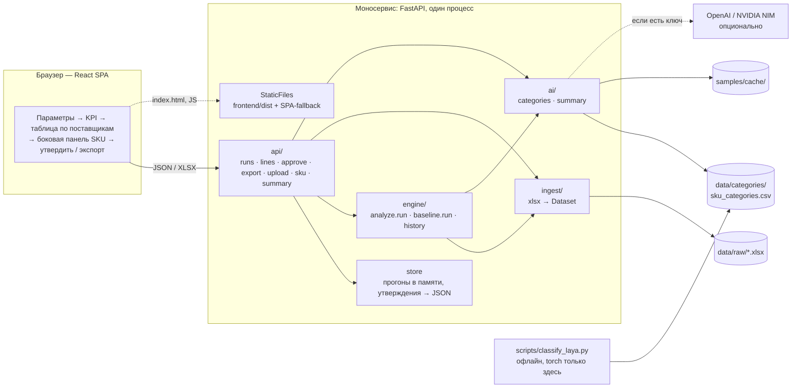

# Автоматический расчёт заказов поставщикам — дизайн

Кейс: трек 05 «Логистика», ТОО «Электрокомплект» (ekt.kz). Команда GrimStack, 3 человека.
Дата: 23.09.2026. Соревновательная часть длится 5 часов, оценка техническая:
функциональность 20, техреализация 25, README 20, воспроизводимость 20, надёжность 15.
Demo Day 29.09 — только для финалистов: ценность 25, результат 20, инновационность 15,
масштабирование 20, презентация 20.

Фактура по данным, на которую опирается этот документ, — в [data-profile.md](data-profile.md).

## 1. Что строим

Сценарий менеджера закупа:
1. Выбирает поставщика и категорию, запускает расчёт.
2. Получает список рекомендованных заказов, сгруппированный по поставщикам. У каждой
   строки есть обоснование.
3. Правит количества, утверждает заказ и выгружает XLSX для 1С.

Автоотправки поставщику нет, утверждает только человек.

Главный аргумент для жюри — сравнение с тем, как считают сейчас. В рабочей таблице SE
менеджер делит сумму складов и товара в пути на среднее за «12 месяцев», которые на деле
13 месяцев, включая неполный сентябрь. Получается «Запас» в месяцах. Колонка «Заказ»
пустая. Проблемы этого подхода:
- одна строка на 7 488 шт или отгрузка LOOP на 210 000 шт раздувают среднее;
- месяцы без товара его занижают;
- сезонность партнёра посчитана по выручке, а не в штуках.

Сервис считает весь ассортимент за секунды и раскладывает каждую цифру на составляющие.
Рядом с нашей рекомендацией стоит результат Excel-метода.

## 2. Архитектура

Один контейнер, один процесс, один порт. FastAPI отдаёт `/api/*` и раздаёт собранный
React, `frontend/dist` закоммичен. Жюри запускает только Python:
`pip install -r requirements.txt && python -m app`. Деплой — один сервис на Northflank
Sandbox, без базы данных. Второй слот остаётся свободным.



Внутри `engine` расчёт идёт одним конвейером. Каждый шаг кладёт свой компонент в обоснование:

```
Dataset → cleaning (паллеты, разовые строки) → stockout (восстановление) → segment (SBC)
        → forecast (база × сезон × тренд × прирост) → policy (S, SS, кратность, срочность)
        → explain (components + текст) → RunResult
```

`baseline.run` — Excel-метод менеджера с тем же интерфейсом. Это честная альтернативная
реализация, а не заглушка.

Раскладка каталогов и владельцы. А — Aliar вместе с этой сессией, Б — тиммейт на
бэкенде/API, Ф — тиммейт на фронте.

```
app/
  __main__.py      запуск uvicorn                                   [Б]
  main.py          FastAPI, /health, StaticFiles + SPA-fallback       [Б]
  contracts.py     Pydantic-контракт (раздел 6), заморожен            [А]
  ingest/          xlsx → Dataset, IngestError                        [А]
  engine/          cleaning · stockout · forecast · policy · explain
                   analyze · baseline · history                       [А]
  ai/              categories (CSV Laya), summary (LLM + кэш)         [А]
  api/             роутеры                                            [Б]
  store.py         прогоны в памяти, утверждения в JSON               [Б]
frontend/          Vite + React + TS                                  [Ф]
data/raw/<iek|se>/<role>.xlsx                                         [А]
data/categories/sku_categories.csv                                    [А]
samples/cache/                                                        [А]
scripts/classify_laya.py                                              [А]
contracts/sample_run.json, sample_sku_history.json                    [А]
tests/engine/  приёмка must-have        tests/api/  тесты API          [А] / [Б]
requirements.txt, .env.example                                        [Б]
Dockerfile, деплой Northflank                                         [А]
README.md                                                             [Ф]
docs/                                                                 [А]
```

Правила совместной работы:
- работаем в `main` без веток;
- каждый правит только свои файлы и перед коммитом делает `git pull --rebase`;
- коммит — каждый час, каждый под своим аккаунтом.

Контракт (раздел 6) после коммита меняется только по договорённости.

## 3. Данные

Выгрузки партнёра лежат в `data/raw/<supplier>/<role>.xlsx`. Репозиторий приватный,
клиентских данных в файлах нет.

| Роль | IEK | SE (Systeme Electric) |
|---|---|---|
| `monthly_sales` | Помесячные продажи, шт, 01.2024–09.2026 | То же, плюс «Артикул», «Кратность» |
| `monthly_stock` | Остаток на 1-е число, 01.2024–09.2026 | То же (сумма складов) |
| `sales_tx` | Строки расходных накладных, 01.2025–22.09.2026 | То же, включая паллетный поток |
| `in_transit` | «Путь»: 6 поставок, ETA 30.09–15.10 | Рабочий лист менеджера (TDSheet) |
| `moq` | «Мин. разр. к отгр.» — кратность | «Кратность» |
| `seasonality` | Выручка IEK по месяцам (справочно) | Выручка SE по месяцам (справочно) |

Правила загрузки (строки заголовков, строка «Итого», словарь месяцев, `code = str(x).strip()`)
описаны в [data-profile.md](data-profile.md), §1–2.

Источники по назначению:

| Что | Источник |
|---|---|
| Ряд спроса | `monthly_sales`: закрытые месяцы 01.2024–08.2026. Сентябрь 2026 неполный, в расчёт не идёт |
| Разовые строки, доля дней в наличии, ссылки на документы | `sales_tx`, только 2025+ |
| Текущий остаток SE | TDSheet: Свободный + Витрина + ТЗ + РЦ ЕКТ + Розничный |
| Текущий остаток IEK | `max(0, остаток на 01.09 − продажи 1–21.09)`, флаг `approx_stock` (нижняя граница) |
| В пути | IEK: сумма колонок «Пути»; SE: «СЭ в пути» |
| Кратность | IEK: MOQ → упаковка из названия `(N)` → 1. SE: «Кратность» |
| Категория | SE: «Категория 2026». IEK: ABC по количеству за 12 мес (границы 80/95 %). Плюс товарная группа от Laya |
| Себестоимость | SE: «СС реал». У IEK нет |

Дефолты поставщиков (конфиг, правятся в интерфейсе):

| | IEK | SE |
|---|---|---|
| Срок поставки L | 24 дня | 40 дней |
| Период между заказами R | 7 дней | 30 дней |

Каждая строка несёт флаг, откуда взят её остаток.

## 4. Алгоритм `analyze`

Все расчёты — по SKU на месячной сетке. Дата расчёта — 22.09.2026, горизонт считается от неё.

1. **Паллетный поток SE.** Строки с `Кратность ≥ 50`, `q ≥ Кратность` и `q` кратным
   `Кратность` — это отдельный регулярный канал. Его нет в помесячном файле. Такие строки
   не учитываются в статистике разовых заказов.
2. **Разовые крупные строки** (транзакции 2025+). У SKU должно быть не меньше 5 строк,
   у SE — не меньше 20. Строка отмечается, если выполнено хотя бы одно из двух правил.

   Правило B, все четыре условия сразу:
   - `q > 5 × медиана строк SKU`;
   - `q > Q3 + 3·IQR`;
   - `q ≥ медиана ненулевых месяцев SKU` (у SE — `≥ среднего месяца`);
   - такие строки у SKU встречались не больше чем в 3 месяцах из 21 (у SE — в 4).

   «Беспрецедентная» строка: `q ≥ 2 ×` вторая по величине строка SKU.

   Отмеченную строку заменяем типичной строкой SKU (медианой): обычный объём клиент
   купил бы и так. Срезанный излишек вычитаем из ячейки помесячного ряда, но не ниже 0.
   Обрезка до порога `5·мед` оставляла месяц раздутым вдвое и проваливала проверку
   must-have №4. От ложных срабатываний защищает строгое правило из четырёх условий. Документ с ≥ 3 отмеченными
   строками помечается как «проектный». Компонент — `oneoff_excluded`.
3. **Stockout и упущенный спрос**, только после шага 2. `open = S[m]`, `close = S[m+1]`.
   Типы месяцев:
   - `full` — `open ≤ 0` и `close ≤ 0`;
   - `start` — `open ≤ 0`, `close > 0`;
   - `end` — `open > 0`, `close ≤ 0`;
   - `effective` — `open < 0.25·база`.

   Восстанавливаем аддитивно: `спрос = q_очищ + база × (1 − доля_дней_в_наличии)`.
   - База — медиана 6 предыдущих месяцев, когда товар был в наличии; таких месяцев нужно
     не меньше 3. Добавка ограничена сверху `2·база`.
   - Доля дней в наличии для 2025+ считается по транзакциям (рабочие дни пн–сб).
   - Для 2024 доля по умолчанию: `full` = 0, `start` и `end` = 0.5.

   Компонент — `stockout_restored`.
4. **Сегментация по Syntetos–Boylan** (последние 12 мес):
   - smooth/erratic → прогноз по шагу 5;
   - intermittent/lumpy → min-max, минимум равен медианному размеру продажи;
   - нет продаж за 12 месяцев → не заказывать.
5. **Прогноз** `forecast(m) = база × season(m) × trend × (1 + growth_pct/100)`.
   - **База** — среднее очищенного и восстановленного ряда за последние 12 закрытых месяцев,
     из которого убрана сезонность.
   - **Сезонность** — профиль в штуках по группе `code[:4]`, посчитанный на очищенном ряду
     и нормированный к среднему 1. Если группа мала или код не вида `\d{9}_`, берётся
     группа Laya, затем профиль поставщика. Собственный профиль SKU подмешивается как
     `0.3·свой + 0.7·группа`, если у SKU ≥ 24 месяца продаж и корреляция 2024↔2025 ≥ 0.6.
   - **Тренд** — `T = Σ последних 6 мес / Σ тех же мес год назад`, ограничен [0.67; 1.5].
     Затем сжимается: `T = 1 + (T−1)·n/(n+6)`, где n — число месяцев с продажами в обоих
     годах. На бэктесте WAPE: IEK 0.309 против 0.367 без тренда, SE 0.130 против 0.209.
6. **Политика пополнения.**
   - Точка заказа `S = Σ forecast на (L+R) + z·σ·√((L+R)/30)`, σ — по очищенному ряду
     за 12 мес.
   - Уровень сервиса z по категории: A / «Кат. 1» 0.97 (z = 1.88); B / «Кат. 2» 0.95 (1.64);
     C / «Кат. 3» 0.90 (1.28). «Кат. 5» (новинки): z как у B, прогноз по группе.
   - `net = S − остаток − в пути (ETA ≤ горизонта)`, заказ `= ceil(net/кратность)·кратность`.
   - Не заказываем: маркер `!!!`, «Кат. 7», кратность 0.
   - 34 SKU IEK с пометкой «поддерживаем склад на 1 мес» получают целевое покрытие 1 месяц.
7. **Срочность** считается только для строк с заказом > 0. Дни покрытия =
   (остаток + в пути с ETA ≤ L) / дневной прогноз.
   - `critical` — меньше L;
   - `high` — меньше L+R;
   - `planned` — иначе.

   Строки без заказа получают `none`.

   Флаг `overstock` — если остаток плюс в пути больше `S` + 3 месяца спроса.

Категории влияют на итог через уровень сервиса, правило «не заказывать» и выбор пула
сезонности. Поэтому изменение любого источника меняет результат: продажи, остатки,
в пути, категории, прирост. Это must-have №1.

**`baseline` (Excel-метод).** Та же политика `S − остаток − в пути` с тем же
округлением, но спрос считается «как в Excel»:
- среднее сырых продаж за последние 12 мес, без очистки, восстановления, сезонности и тренда;
- σ — по сырому ряду.

Разница `analyze − baseline` в каждой строке показывает вклад наших методов.

## 5. Демо-SKU (проверены по данным)

| Проверка | SKU | Что показываем |
|---|---|---|
| MH1 в пути | SE 030200193_ IMT35150 | В пути 37 800 = 10 × кратность 3 780: заказ 22 680; без «в пути» — 60 480. Excel-метод — 0 |
| MH2 сезон | IEK 130300792_ Труба Ø50 | Октябрь 8 685 → 13 414, январь ~600; группа 1303 с размахом 4.4×; заказ 14 800 м, срочно |
| MH2 рост | SE 030200201_ IMT35101 | 148 911 (2024) → 231 760 (2025) → +29 % в 2026: заказ 13 560, Excel-метод — 0 |
| MH3 stockout | IEK 010300096_ УЗО АВДТ 32 | Май 2025: строка на 630 шт → июнь начался с 0 → «разовый заказ, затем stockout» |
| MH3 stockout | IEK 130200124_ Шина ШНИ-14 | Остаток 0 в феврале–апреле 2025, продажи 0/0/43 → спрос восстановлен |
| MH4 разовый | IEK 010500008_ ВА47-29 25А | 7 488 шт 02.09.2026, 2.9× второй по величине строки → заменена типичной |
| MH4 разовый | IEK 010300096_ УЗО АВДТ 32 | Строка 630 шт 15.05.2025 при типичной ~20 → заменена типичной |
| MH4 паллеты | SE 030300013_ У-195 | 23 паллетные строки (6 480, 10 908 шт) — отдельный канал, разовыми не считаются |

IEK 010500006_ (крупнейший SKU, в пути 30 000) заказа не получает: остаток 45 780 перекрывает
потребность и без товара в пути. Отгрузка LOOP 130200305_ на 210 000 шт — единственная продажа
SKU, в помесячном файле её нет; на заказ она не влияет, а детектору не хватает строк для статистики.
Все строки таблицы проверяет `tests/engine/test_real_data.py`.

## 6. Контракт

### Python — `app/contracts.py`

```python
Supplier = Literal["IEK", "SE"]
Urgency = Literal["critical", "high", "planned", "none"]

class RunParams(BaseModel):
    supplier: Supplier | None = None          # None — все поставщики
    category: str | None = None
    method: Literal["analyze", "baseline"] = "analyze"
    lead_time_days: int | None = None         # None — дефолт поставщика
    review_period_days: int | None = None     # None — дефолт поставщика
    service_level: float | None = None        # None — по категории
    growth_pct: float = 0.0

class Component(BaseModel):                   # шаг обоснования
    # kind="qty": шаг «водопада», все qty-компоненты в сумме дают recommended_qty
    #   (horizon_demand + safety_stock + stock(−) + in_transit(−) + moq_rounding);
    # kind="factor": множитель прогноза; kind="info": справочное количество, в сумму не входит
    key: str        # base | seasonality | trend | growth | oneoff_excluded | stockout_restored
                    # | horizon_demand | safety_stock | stock | in_transit | moq_rounding
    label: str      # подпись по-русски
    value: float
    kind: Literal["qty", "factor", "info"]
    note: str | None = None

class OrderLine(BaseModel):
    line_id: str                              # "IEK:200400085_"
    supplier: Supplier
    sku: str                                  # код 1С
    article: str | None                       # артикул поставщика
    name: str
    unit: str
    category: str | None                      # «Кат. 1» / ABC-класс
    product_group: str | None                 # группа Laya
    stock_free: float
    stock_source: Literal["warehouses", "estimate_lower_bound"]
    in_transit: float
    forecast_monthly: float                   # прогноз на ближайший полный месяц
    safety_stock: float
    order_up_to: float
    moq: float
    recommended_qty: float
    final_qty: float                          # правится менеджером, изначально = recommended_qty
    baseline_qty: float | None
    urgency: Urgency
    days_of_cover: float | None
    unit_cost: float | None
    amount: float | None                      # final_qty × unit_cost
    explanation: str                          # одна строка для таблицы
    components: list[Component]
    flags: list[str]    # oneoff_excluded | project_order | stockout_restored | seasonal | trend_up
                        # | trend_down | intermittent | overstock | no_history | approx_stock
                        # | discontinued | do_not_order | keep_1m | new_item

class SupplierSummary(BaseModel):
    supplier: Supplier
    supplier_name: str
    lines_count: int
    critical_count: int
    total_qty: float
    total_amount: float | None
    status: Literal["draft", "approved"] = "draft"
    approved_at: datetime | None = None

class RunKpi(BaseModel):
    lines_to_order: int
    critical: int
    total_amount: float | None
    oneoff_units_excluded: float
    stockout_units_restored: float
    overstock_lines: int

class RunResult(BaseModel):
    run_id: str
    created_at: datetime
    params: RunParams
    data_as_of: date
    kpi: RunKpi
    suppliers: list[SupplierSummary]
    lines: list[OrderLine]                    # строки с recommended_qty > 0 или urgency != "none"
    warnings: list[str]

class OneoffEvent(BaseModel):
    date: date
    doc: str                                  # хэш документа
    qty: float
    capped_to: float

class SkuHistory(BaseModel):
    supplier: Supplier
    sku: str
    name: str
    months: list[str]                         # "2024-01" … "2026-08"
    raw: list[float]
    cleaned: list[float]                      # после вычета разовых строк
    restored: list[float]                     # после восстановления stockout
    stockout: list[str | None]                # None | full | start | end | effective
    forecast_months: list[str]
    forecast: list[float]
    oneoff_events: list[OneoffEvent]
```

Функции ядра, которые вызывает API:

```python
from app import ingest, engine, ai

ingest.load_default() -> Dataset                                               # встроенные data/raw
ingest.load_uploaded(supplier: Supplier, files: dict[str, bytes]) -> Dataset   # ключи — роли из §3
    # обязательные роли: monthly_sales, monthly_stock, in_transit, moq
    # при ошибке: IngestError(code, message, file_role) → 422
engine.run(data: Dataset, params: RunParams) -> RunResult    # params.method: analyze | baseline
engine.history(data: Dataset, supplier: Supplier, sku: str, params: RunParams) -> SkuHistory
engine.meta(data: Dataset) -> Meta
ai.summary(result: RunResult, supplier: Supplier) -> SummaryResponse | None   # None → 503
```

Сигнатуры заморожены. До готовности ядра функции отдают моки из `contracts/*.json`,
так что API подключается к ним сразу. `RunParams.dataset_id` выбирает загруженный
датасет, при `None` используются встроенные выгрузки.

### HTTP — владелец Б

| Метод | Путь | Ответ |
|---|---|---|
| GET | `/health` | `{"status": "ok"}` |
| GET | `/api/meta` | поставщики, категории, дефолтные L/R, `data_as_of` |
| POST | `/api/runs` (тело `RunParams`) | `RunResult` |
| GET | `/api/runs/{run_id}` | `RunResult` |
| PATCH | `/api/runs/{run_id}/lines/{line_id}` (`{"final_qty": n}`) | `OrderLine` |
| POST | `/api/runs/{run_id}/suppliers/{supplier}/approve` | `SupplierSummary` |
| GET | `/api/runs/{run_id}/export.xlsx?supplier=IEK` | XLSX для 1С |
| GET | `/api/sku/{supplier}/{sku}/history` | `SkuHistory` |
| POST | `/api/datasets/{supplier}` (multipart, поля — роли) | `{"dataset_id", "warnings"}` или 422 |
| POST | `/api/runs/{run_id}/summary?supplier=IEK` | `{"text", "cached"}` |

- Все ошибки возвращаются в едином формате `{"detail": str, "code": str, "meta": {}}`.
- Некорректный ввод (пустой файл, не xlsx, нет нужных колонок, `final_qty < 0`) даёт 422
  с понятным `detail`.
- Колонки XLSX для 1С: Код 1С · Артикул поставщика · Наименование · Ед. · Количество ·
  Цена · Сумма · Поставщик · Срочность · Обоснование.
- Примеры ответов для работы фронта на моке — `contracts/sample_run.json` и
  `contracts/sample_sku_history.json`.

## 7. Интерфейс (владелец Ф)

Один экран и боковая панель.

- **Панель параметров:** поставщик, категория, метод (наш / Excel), L, R, уровень сервиса,
  прирост %, кнопка «Рассчитать».
- **KPI-плитки:** позиций к заказу, критичных, сумма (SE), исключено разовых (шт),
  восстановлено упущенного (шт), излишки.
- **Таблица по поставщикам:**
  - колонки: код 1С, артикул, наименование, остаток (с пометкой, если это оценка), в пути,
    прогноз/мес, рекомендация, Excel-метод, кратность, итог (редактируется), срочность
    (бейдж), обоснование;
  - сортировка по срочности.
- **Боковая панель SKU:**
  - график по месяцам «сырой / очищенный / восстановленный / прогноз»;
  - stockout-месяцы затенены, разовые строки отмечены;
  - «водопад» из `components` и текст обоснования.
- **Действия по поставщику:** «Утвердить», «Экспорт XLSX», «Сводка» (LLM).
- **Загрузка своих выгрузок:** форма по ролям файлов, ошибки 422 показываются у поля.
- Обязательные состояния: загрузка, ошибка, пустой результат.

## 8. AI-слой (владелец А)

- **Laya** (Convai Innovations, мультиязычный чекпойнт на mmBERT, Apache 2.0).
  - Офлайн-скрипт `scripts/classify_laya.py` раскладывает наименования по 10–15 товарным
    группам (вопрос `choice`) и пишет `data/categories/sku_categories.csv` (sku, group, prob).
  - Сервис только читает этот CSV, torch в образ не попадает.
  - При вероятности ниже порога группа определяется правилами по ключевым словам.
  - Где используется: фильтр, пул сезонности для кодов без группы `code[:4]`, тренды
    по группам.
- **LLM-сводка.**
  - OpenAI SDK, `OPENAI_BASE_URL` берётся из окружения; запасной вариант — NVIDIA NIM.
  - На вход — уже посчитанные цифры заказа поставщику, на выходе — резюме для менеджера.
  - Живые ответы кэшируются в `samples/cache/` по хэшу входа. Без ключа отдаётся кэш
    с пометкой, без кэша кнопка неактивна.
  - Расчёт от LLM не зависит.

## 9. Проверка

Приёмка `tests/engine/test_acceptance.py` на синтетических наборах, по тесту на каждое
must-have:

1. Больше товара в пути → меньше заказ. Изменение остатка, категории или прироста тоже
   меняет результат.
2. Сезонный SKU: прогноз в пиковый месяц выше, чем в спадовый, и отличается от плоского
   среднего.
3. SKU с stockout-месяцами: потребность выше, чем по сырым продажам.
4. Вставленная разовая строка ×20 от типичной меняет рекомендацию не больше чем на 10 %.
5. У каждой строки есть поставщик, непустые `explanation` и `components`; строки
   группируются по поставщикам.

Дополнительно:
- **Smoke на реальных данных:** оба поставщика считаются без исключений, нет NaN,
  количества ≥ 0 и кратны кратности. Демо-SKU из §5 дают ожидаемые флаги.
- **Тесты API (Б):** коды 200/404/422, некорректная загрузка, PATCH с отрицательным
  количеством.

## 10. Контрольные точки

| Время | Итог | Кто |
|---|---|---|
| 0:30 | `docs/`, `app/contracts.py`, `contracts/*.json` | А |
| 1:00 | Каркас: `ingest` на реальных данных (А), API на моке (Б), экран на моке (Ф) | все |
| 2:00 | Сквозной путь на `baseline`: реальные данные → API → экран | все |
| 3:00 | `analyze` целиком, приёмка зелёная, боковая панель с графиком | все |
| 4:00 | Стоп фичам. `npm run build`, `dist/` закоммичен, кэш LLM заполнен | все |
| 4:00–5:00 | README (Ф), проверка на чистом клоне (Б), Docker и деплой на Northflank (А) | все |

## 11. Ограничения (для README)

- Клиентского ID нет. Прокси — документ-накладная; номер хэшируется.
- Транзакции есть только с 2025 года. В 2024 разовые строки не вычищаются, для stockout
  используется доля дней по умолчанию.
- Паллетный поток SE (19 SKU, 53 % транзакций) не проходит через склад и в базовый спрос
  не входит.
- Текущий остаток IEK — нижняя граница: приходы сентября неизвестны.
- У IEK нет цен, поэтому сумма заказа считается только для SE.
- Сроки поставки — из дат «Пути» (IEK) и допущения 40 дней (SE). Правятся в интерфейсе.
- Материальная ведомость 1С не предоставлена.
- Прогноз помесячный. Дневная детализация используется для разовых строк и доли дней
  в наличии.
